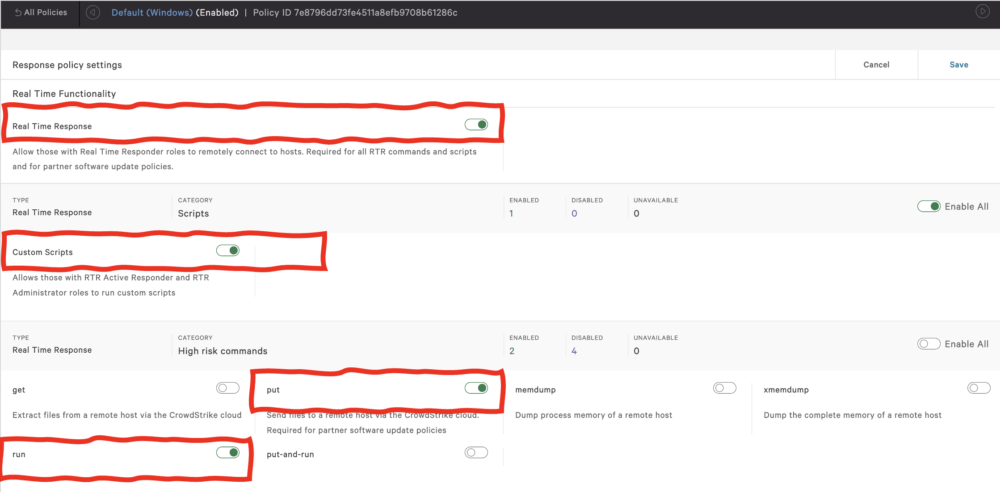

# PushHosts v1.2

This is a script to be used by CrowdStrike Falcon clients, that fetches CID or Host Group hosts, and uses the batch command and offline queuing of Real-Time Response API to centrally and conveniently push HOSTS files to Windows.

The script uses the fantastic [FalconPY SDK](https://github.com/crowdstrike/falconpy)

- It uses native RTR commands, which will not trigger a detection/prevention in relation to sensor anti-tampering. 
- Because it uses the RTR API it is run centrally through our cloud, it does NOT need to be distributed to each targeted host. 
- The script uses the queuing feature of RTR, so hosts don't need to be online at the time the script is executed, they will receive the commands if they connect to our cloud within the next 7 days.
- The hosts file to push to endpoints is selectable (by hash) from the files uploaded in the "[put files](https://falcon.crowdstrike.com/real-time-response/scripts/put-files?)" section of the console.
- When using CID as scope, the script checks that the CID specified corresponds to the CID where the API client is created.
- The script checks that the file being pushed to the endpoints exists in the console.

‼️WARNING‼️
This script has the potential to disrupt network connections from the endpoint. It is recommended users test with a limited Host Group first to troubleshoot any issues.

‼️WARNING‼️
This script is still undergoing testing. Please see warning above. Your mileage may vary. You're on your own, etc.


## Running the program

### Step 0 - Install FalconPY

This script relies on [FalconPY SDK](https://github.com/crowdstrike/falconpy) to work.

In the machine where you have Python installed, please use the following command to install FalconPY.

```shell
python3 -m pip install crowdstrike-falconpy
```


### Step 1 - API client

In order to run this script, you will need access to CrowdStrike [API keys](https://falcon.crowdstrike.com/api-clients-and-keys/clients) with the following scopes:


| Service Collection | Scope |
| :---- | :---- |
| Hosts | __READ__ |
| Host Group | __READ__ |
| Real-Time Response | __WRITE, READ__ |
| Real-Time Response (admin) | __WRITE__ |
| Sensor Download | __READ__ |

### Step 2 - RTR Policy

In addition to this you will need the endpoints to be asigned to a "[Response Policy](https://falcon.crowdstrike.com/configuration/real-time-response/policies)" that allows "Real Time Response", and has the "put" command enabled.




### Step 3 - Upload file

Lastly, the desired "hosts" file to push to Windows endpoints needs to be uploaded to the "Falcon Real Time Response" > "[put files](https://falcon.crowdstrike.com/real-time-response/scripts/put-files?)" section in the console.

For this step, remember that the user uiploading the file needs to have the "Real Time Responder - Administrator" role.


### Step 4 - Execution

This script accepts the following input parameters.
| Parameter | Purpose | Category |
| :--- | :--- | :--- |
| `--falcon_client_id` | Falcon API client ID | required |
| `--falcon_client_secret` | Falcon API client secret | required |
| `--scope` | `cid` or `hostgroup` | required |
| `--scope_id` | Either the CID or the Host Group ID | required |
| `--base_url` | CrowdStrike base URL (only required for GovCloud, pass usgov1) | optional |
| `--hosts_file` | Hash (SHA256) of the "[put file](https://falcon.crowdstrike.com/real-time-response/scripts/put-files?)" to push to endpoints as "hosts" file | required |

If you want to push a hosts file:

```shell
python3 pushhosts.py --falcon_client_id FALCON_CLIENT_ID --falcon_client_secret FALCON_CLIENT_SECRET 
                        --scope hostgroup --scope_id HOST_GROUP_ID --hosts_file FILEHASH
```


